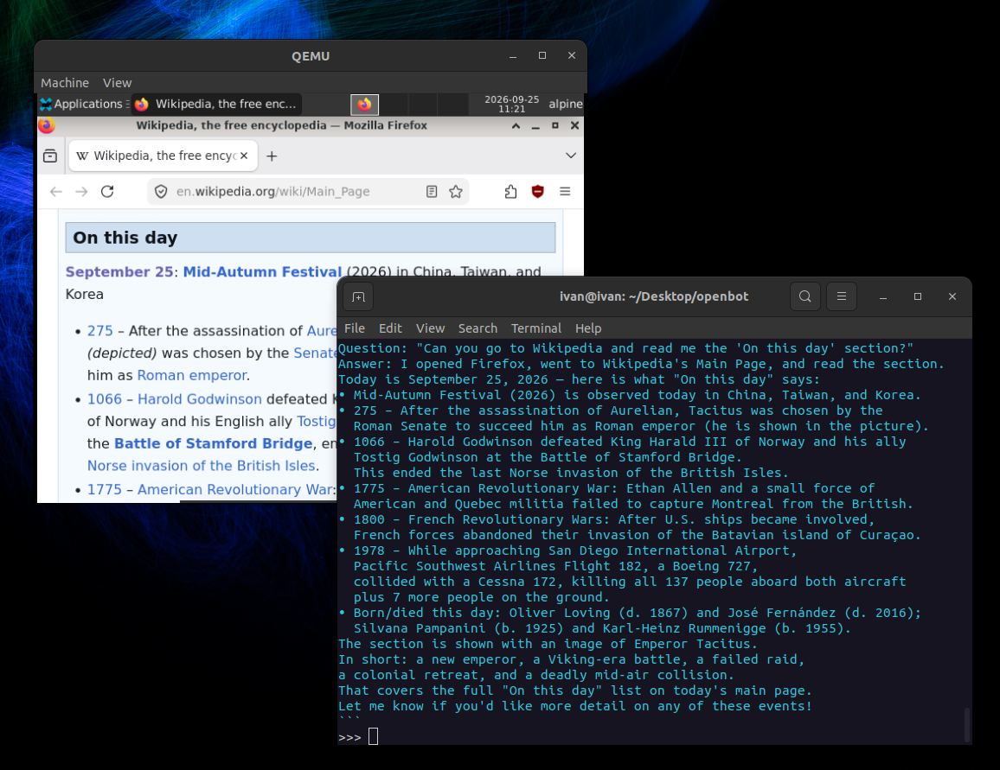

# OpenBot

An AI agent that drives a real graphical desktop inside a virtual machine.

OpenBot boots an Alpine Linux Virtual Machine (VM) under QEMU/KVM, hands the model tools and lets it operate the desktop the way a human would.



## Requirements

Host (Linux):

- KVM-capable CPU and `/dev/kvm` access
- `qemu-system-x86_64` with GTK display support
- `make`, `ssh-keygen`
- `sudo` (used to build the disk image)
- `python3` with [`litelm`](https://pypi.org/project/litelm/) and Pillow
- An LLM Provider API Key of your choice. See `litelm` providers support.

## Quick start

`model` argument is required and takes `provider/model` format. The provider prefix selects which API key it reads, so export it first:

```sh
export OPENROUTER_API_KEY='sk-or-...'
make setup                                   # build VM image
python3 openbot.py openrouter/glm-5.3-flash  # interactive prompt
```

Or give it a task directly:

```sh
export OPENAI_API_KEY='sk-or-...'
python3 openbot.py openai/gpt-5 --prompt "open wikipedia and tell me what is on the frontpage"
```

## The VM

| | |
| --- | --- |
| Image | `openbot.qcow2` (qcow2, 12G) |
| Machine | q35, KVM accel, `-cpu host`, 2 vCPU, 3G RAM |
| Display | GTK window, framebuffer fixed at **1024x768** |
| Network | user-mode NAT, host port **2222** → guest 22 |
| QMP | `/tmp/openbot-qmp.sock` (used for screenshots) |

## Tools

| Tool | What it does |
| --- | --- |
| `start` | Boots the VM, waits for SSH and the XFCE session to come up |
| `stop` | Graceful `poweroff`, escalating to terminate/kill if it hangs |
| `run` | Runs a shell command in the VM as `alpine` (30s timeout) |
| `screenshot` | QMP screendump → PNG, attached to the conversation as an image |
